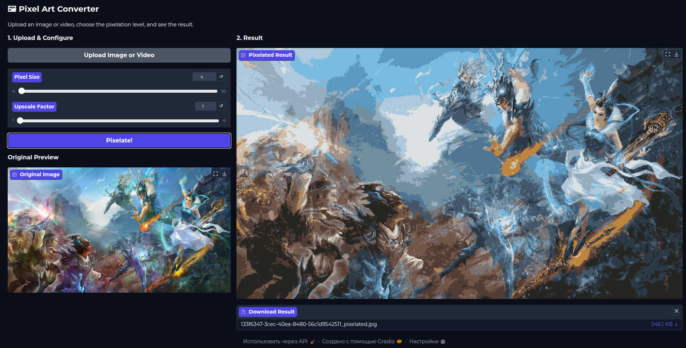

# Пиксель-Арт Конвертер

**Язык / Language:** <ins>Русский</ins> **|** [English](../README.md)

Это веб-приложение позволяет вам преобразовывать изображения, видео и GIF-анимации в стиль пиксель-арт. Вы можете загрузить файл, выбрать уровень пикселизации и применить коэффициент увеличения к результату. Приложение создано на FastAPI и оснащено удобным пользовательским интерфейсом на Gradio.



## Возможности

- **Поддержка изображений и видео**: Обрабатывайте как статичные изображения, так и анимированные видео.
- **Настраиваемый размер пикселя**: Регулируйте уровень детализации, изменяя размер пиксельных блоков.
- **Коэффициент увеличения (апскейл)**: Увеличивайте разрешение итогового изображения (например, 2x, 4x).
- **Веб-интерфейс**: Простой в использовании UI на базе Gradio.
- **Документация API**: Интерактивная документация API доступна через Swagger UI.

## Начало работы

Вы можете запустить этот проект напрямую с помощью Python или используя Docker.

### Требования

- Python 3.9+
- Менеджер пакетов Pip
- Docker (для запуска через Docker)

### Вариант 1: Запуск с помощью Python

1.  **Клонируйте репозиторий**:
    ```bash
    git clone https://github.com/QueenDekim/pixelate-all.git
    cd pixelate-all
    ```

2.  **Создайте и активируйте виртуальное окружение** (рекомендуется):
    ```bash
    python -m venv .venv
    source .venv/bin/activate
    # Для Windows используйте: .venv\Scripts\activate
    ```

3.  **Установите зависимости**:
    ```bash
    pip install -r requirements.txt
    ```

4.  **Запустите приложение**:
    ```bash
    uvicorn app.main:app --host 0.0.0.0 --port 8080
    ```

5.  **Откройте приложение**:
    Откройте ваш веб-браузер и перейдите по адресу `http://127.0.0.1:8080`.

### Вариант 2: Запуск с помощью Docker

1.  **Клонируйте репозиторий**:
    ```bash
    git clone https://github.com/QueenDekim/pixelate-all.git
    cd pixelate-all
    ```

2.  **Соберите Docker-образ**:
    ```bash
    docker build -t pixel-art-converter .
    ```

3.  **Запустите Docker-контейнер**:
    ```bash
    docker run -p 8080:8080 pixel-art-converter
    ```

4.  **Откройте приложение**:
    Откройте ваш веб-браузер и перейдите по адресу `http://127.0.0.1:8080`.

## Тестирование

Чтобы запустить тесты, сначала установите зависимости для разработки:

```bash
pip install -r requirements-dev.txt
```

Затем запустите `pytest` из корневой директории:

```bash
pytest --cov=app
```

Это запустит все тесты и сгенерирует отчёт о покрытии кода.

## Документация API

После запуска приложения вы можете получить доступ к интерактивной документации Swagger UI, чтобы изучить эндпоинты API.

-   **Документация Swagger**: `http://127.0.0.1:8080/docs`

Это даёт наглядное представление о доступных эндпоинтах, параметрах и моделях ответов.

## Автономное использование API

Помимо интерфейса Gradio, приложение предоставляет автономный эндпоинт API по адресу `/api/pixelate`, который возвращает обработанный файл напрямую. Это идеальный вариант для использования в скриптах или для интеграции с другими сервисами.

### Пример с использованием cURL

Вот пример использования API с помощью `curl` для обработки изображения с именем `my_image.png`:

```bash
curl -X 'POST' \
  'http://127.0.0.1:8080/api/pixelate' \
  -F 'file=@/path/to/your/my_image.png' \
  -F 'pixel_size=12' \
  -F 'upscale_factor=2' \
  --output pixelated_image.png
```

-   Замените `/path/to/your/my_image.png` на реальный путь к вашему файлу.
-   Обработанный файл будет сохранён под именем `pixelated_image.png` в вашей текущей директории.
